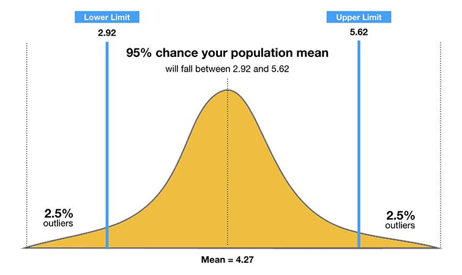

Hypothesis  testing  is  performed to  identify  if  there  is  a  relationship  between  the  attributes (columns)  of  our  data  set.  Hypothesis testing  is  only  used  to  confirm  that  there  is  a  relation between the attributes considered but does not define the nature of the relationship.

To perform hypothesis testing, we first initially form 2 different hypotheses:
- Null Hypothesis   
  - No difference between data considered
- Alternate Hypothesis   
  – There is a difference between the data considered 
  
For example, if we want to perform a hypothesis testing to check if a car’s transmission type (Manual or Automatic) has an impact on the price of a car then our hypothesis would be:

• Null Hypothesis–There is no difference in the price range of a car based on its
Null Hypothesis–type of transmission•Alternate Hypothesis–There is a statistical difference in the price range of a car basedAlternate Hypothesis–on its type of transmissionKindly find a video explaining hypothesis testing in more detail here.CONFIDENCE INTERVALThe confidence interval determines the range of values which the true mean lies. For example, if data is collected regarding the height of men then, a `95% confidence interval` provides the range of height within which the true mean of all men’s height lie.

## CONFIDENCE INTERVAL

The confidence interval determines the range of values which the true mean lies. For example, if data is collected regarding the height of men then, a 95% confidence interval provides the range of height within which the true mean of all men’s height lie.

## P-Value

The p-value of a test provides the probability of gaining results in the extreme cases under the assumption that the null hypothesis is correct. If a p-value is large,then the probability of such a result is very high and if  p-value is low then the probability of such a result is very low under the considered null hypothesis.

We chose a significance value to determine when to reject the null hypothesis. Conventionally, 0.05 is chosen as the significance level such that if p-value is less the 0.05 then wereject the null hypothesis and accept the alternate hypothesis.

> ## More on Confidence Intervals
> You can refer to the below links to learn more in detail:
> 
> - Confidence Interval –MathisFun, YouTube [FIXME add in links]
> - P-value –StatsDirect, YouTube, YouTube2, Towards_Data_Science
{: .callout}

[FIXME add image "true value under null hypothesis"]

## T-TEST

The t-test is used to run a hypothesis testing on one (or) two levels of same factor.

Syntax:
~~~
t.test(Factor 1,            # Values of the first factor
       Factor 2,            # Values of the second factor
       alternative = )      # Check if factor 1 mean is smaller or greater than factor 2 (optional)
~~~
{: .source}

To determine of the transmission type of a car has an impact on its mileage:

~~~
# Storing the mileage of Automatic & Manual transmission cars in individual vectors
Auto_mileage <- mtcars[mtcars$am == "Automatic","mpg"]
Manual_mileage <- mtcars[mtcars$am == "Manual","mpg"]

# T-test to check if transmission type has an effect on the car's mileage
t.test(Auto_mileage, Manual_mileage)
~~~
{: .language-r}

~~~
	Welch Two Sample t-test

data:  Auto_mileage and Manual_mileage
t = -3.7671, df = 18.332, p-value = 0.001374
alternative hypothesis: true difference in means is not equal to 0
95 percent confidence interval:
 -11.280194  -3.209684
sample estimates:
mean of x mean of y 
 17.14737  24.39231 
~~~
{: .output}

See the p-value on line 3 of your output:
> t = -3.7671, df = 18.332, p-value = 0.001374

Since  the  p-value  is  less  than  0.05  we  can  accept  the  alternate  hypothesis  that  there  is  a difference in the mileage of a car based on its transmission type.

We can then use the __alternative__ parameter to determine if the first factor under consideration has a higher mean compared to the second factor.

~~~
# Is the mileage of the automatic transmission less than the mileage of manual transmission?
t.test(Auto_mileage, Manual_mileage, alternative = "less")
~~~
{: .language-r}

~~~
	Welch Two Sample t-test

data:  Auto_mileage and Manual_mileage
t = -3.7671, df = 18.332, p-value = 0.0006868
alternative hypothesis: true difference in means is less than 0
95 percent confidence interval:
      -Inf -3.913256
sample estimates:
mean of x mean of y 
 17.14737  24.39231 
~~~
{: .output}

~~~
# Or, is the mileage of the automatic transmission greater than the mileage of manual transmission?
t.test(Auto_mileage, Manual_mileage, alternative = "greater")
~~~
{: .language-r}

~~~
	Welch Two Sample t-test

data:  Auto_mileage and Manual_mileage
t = -3.7671, df = 18.332, p-value = 0.9993
alternative hypothesis: true difference in means is greater than 0
95 percent confidence interval:
 -10.57662       Inf
sample estimates:
mean of x mean of y 
 17.14737  24.39231 
~~~
{: .output}

From the test and the resulting p-value(s) we can verify that a car with an Automatic transmission has a lower mileage in comparison to manual transmission carin the dataset.

p-value of less:
> t = -3.7671, df = 18.332, p-value = 0.9993

vs. 

p-value of greater:
> t = -3.7671, df = 18.332, p-value = 0.9993

Ok, now let's check the impact of transmission type on horsepower:

~~~
# T-test to check if transmission type has an effect on the car's horsepower
Auto_hp <- mtcars[mtcars$am == "Automatic","hp"]
Manual_hp <- mtcars[mtcars$am == "Manual","hp"]
t.test(Auto_hp, Manual_hp)
~~~
{: .language-r}

~~~
	Welch Two Sample t-test

data:  Auto_mileage and Manual_mileage
t = -3.7671, df = 18.332, p-value = 0.9993
alternative hypothesis: true difference in means is greater than 0
95 percent confidence interval:
 -10.57662       Inf
sample estimates:
mean of x mean of y 
 17.14737  24.39231 
~~~
{: .output}

Since the p-value is greater than 0.05 we can accept the null hypothesis that there is no difference in the horsepower of a car based on its transmission type.

## ANOVA 

The ANOVA test is performed to run hypothesis testing on a factor with more than two levels. In our mtcarsdataset the “cylinder” attribute has three levels while “carburetors” attribute hassix levels.

Syntax: 

~~~
aov(Numerical_column_name~ Categorical_column_name, data =dataframe_name)TukeyHSD(ANOVA_output)
~~~
{: .source}

The initial anova test only provides a result stating if there is an overalldifference.To checkfor differencebetweeneach individuallevel in the factor we use the TukeyHSDfunction.

~~~
# Test performed to see if mileage varies based on number of cylinders 
mileage.aov <- aov(mpg~cyl, data=mtcars)
~~~
{: .language-r} 

~~~
# The below summary provides a single result indicating if mileage
# varies or not
summary(mileage.aov)
~~~
{: .language-r}
~~~
# The TukeyHSD function provides results to indicate if mileage varies
# between each type of cylinder 
TukeyHSD(mileage.aov)
~~~
{: .language-r}



